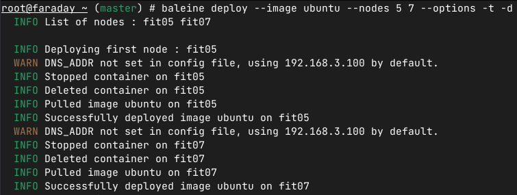

# Baleine 🐋

[Check out the docs !](https://github.com/haysberg/baleine/wiki)

Orchestrate Docker containers over the R2Lab platform from a single CLI. This allows you to manipulate the software run on the different nodes quickly and with ease.
Using the four subcommands of this tool, you can deploy Docker containers on top of the 37 test nodes available in R2Lab.

<p align="center">
  
</p>

## What are the benefits ?

- By using a local repository, we can cache the image downloaded from external sources, allowing for much faster deployment.
- The code is fully multi-threaded, allowing for good scalability.
- The project is completely open-source and all the libraries are contained within the binary, which makes it extremely portable.
- Using Docker containers, we can save, deploy and destroy an instance in mere seconds.
- Thanks to the nature of Docker containers, our experiments can be easily reproduced without having to fiddle with config files.

## Usage

Using the four subcommands of this tool, you can deploy Docker containers on top of the 37 test nodes available in R2Lab.
- `deploy` to automatically deploy containers on the specified nodes with the Docker options you want
- `destroy` to remove the containers
- `save` to save a running container as a new image on the local R2Lab repository
- `list` to get a list of all the images on the repository

To see the full list of available options, please check [the docs](https://github.com/haysberg/baleine/wiki)

## 📥 Installation

Right now, we do not offer a binary that you can download and install. You will need to clone the github repository and compile the code yourself. Once you have Rust installed on your machine, you can use the provided scripts to install the binary.

Use the same procedure to update Baleine.

### Gateway
```sh
git clone https://github.com/haysberg/baleine
cd baleine
./setup_files/build_and_install.sh

# Check if baleine is installed correctly
which baleine
```

### Docker registry & DockerHub proxy
Please note : you can deploy it in the gateway or anywhere else as long as it is reachable by your gateway and nodes.

You will need Docker and docker-compose to run the file.
```sh
wget https://raw.githubusercontent.com/haysberg/baleine/main/setup_files/gateway/docker-compose.yml

# -d detaches the output from the terminal
docker compose up -d
```

### Slave node
This script is made to run on Ubuntu-based systems. It **should** work on Debian systems as well, but it is untested so far.

```sh
sudo sh -c "$(wget https://raw.githubusercontent.com/haysberg/baleine/main/setup_files/nodes/setup_node.sh -O -)"
```
Export the OS to a Rhubarbe image for latter use.

## Current workflow on the faraday gateway

<p align="center">
  
</p>


## 🧰 Configuration

### Gateway
The CLI configuration can be found under `/etc/baleine/baleine.conf`. Here is the default contents :
```yaml
#URL that will be called when listing available images
REGISTRY_URL = "faraday"
#URL that will be transmitted to the slave nodes to save images
SAVE_URL = "faraday.repo"
REGISTRY_PROTOCOL = "http://"
DEFAULT_BOOTSTRAP_IMAGE="baleine"
```

### Slave node
On the slave node, `faraday` and `faraday.repo` point to the data node from the /etc/hosts file.
```
# Snippet from /etc/hosts
192.168.2.100	faraday.repo
```

The Docker daemon is configured through `/etc/docker/daemon.json`.
We add the following lines in the config file :
```json
{
  "insecure-registries" : ["faraday.repo"],
  "registry-mirrors": ["http://faraday.repo:81"]
}
```
`insecure-registries` is the hostname of repositories where using HTTP is authorized to push images and interact with the repo.
`registry-mirrors` is the list of repositories configured as proxies.

Please note that the repository is listening on port 80, and the proxy on port 81.
You can get a better understanding of the configuration if you look at the [docker-compose.yml](https://github.com/haysberg/baleine/blob/develop/setup_files/gateway/docker-compose.yml) file that describes the registries configuration in detail.

The default user is added to the `docker` UNIX group so that you don't need to be `root` on the machine to use Docker.

Users can login directly into the container by connecting as `container@fitxx` instead of logging in as `root`.
The user `container` has a special shell added as the default one, named `rdsh` (Remote Docker SHell). It is listed in `/etc/shells` and the actual shell is in `/bin/rdsh`. Here is the content of the shell :

```bash
#!/bin/bash

if ! docker inspect container > /dev/null 2>&1; then
    echo "No running container on the machine. It might be stopped ?"
    exit 1
elif [[ -z "$@" ]]; then
    docker exec -it container /bin/bash
else
    case "$1" in
	"-c") shift;;
    esac
    docker exec container "$@"
fi
```


## Need help ?

Please refer to the [docs](https://github.com/haysberg/baleine/wiki) to get an exhaustive list of example commands.

📨 Please [open an issue](https://github.com/haysberg/baleine/issues/new) or send me an email in case of bugs : [teo.hays@inria.fr](mailto:teo.hays@inria.fr)
